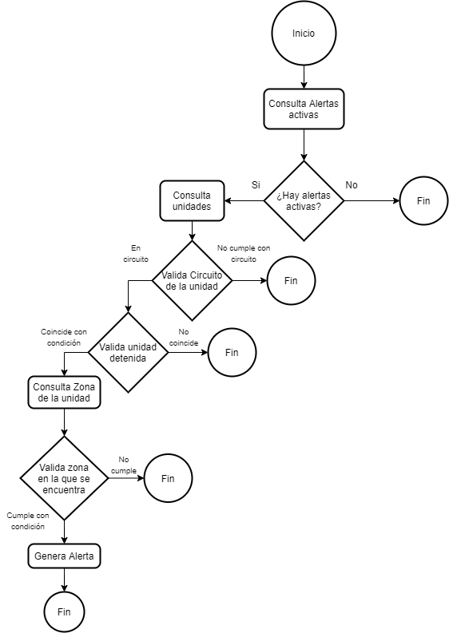

<center>
    <h1>⚠️ Cron Alertas por Zonas ⚠️</h1>
</center>

## 📖 Descripción

Cron que genera alertas en el AVL de acuerdo a los condiciones indicadas en el JSON ```zonas.json```.

## 📦 Requerimientos 

* Node.js v10.x.x: [https://nodejs.org/](https://nodejs.org/)
* pg: [https://node-postgres.com/](https://node-postgres.com/)


## JSON

El JSON es utilizado para indicar la alerta que será generada, indicando las condiciones que accionara dicha alerta.

El archivo JSON esta situado en la raíz del cron.

Ejemplo:

```json
[
    {
        "alerta": {
            "nombre": "CERRO GORDO ROBO PARCIA",
            "id": 217,
            "circuito": [],
            "tipo": {
                "enZona": true,
                "detenida": true
            },
            "horario": {
                "inicio": 23,
                "fin": 6
            },
            "estatus": 1
        },
        "zona": [
            {
                "id": 4254,
                "tipo": -12
            }
        ]
    }
]
```

### Alerta

| Propiedad | Tipo | Descripción |
| --- | :---: | --- |
| nombre | String | Texto informativo acerca de la alerta |
| id | Integer | ID de la alerta registrada en la BD (```tb_tiposdealertas```) |
| circuito | Array | Indica el ID del circuito o circuitos (```tb_circuitos```) que desea que activen la alerta, puede dejar el campo vacio ```[]``` si quiere que se validen todas las unidades  |
| tipo | Array | La alerta será activada cuando se cumplan las condiciones indicadas (Consulte la tabla "Propiedad - tipo" de este documento) |
| horario | Array | Indica el inicio y fin de la validacion de la alerta (formato 24 hrs), ejemplo: ```{"inicio": 10, "fin": 20 }``` . Deje el Array vacio ```{}``` si desea que la alerta este activa las 24 hrs |
| estatus | Integer | Indica si la alerta esta Activa (1) o desactivada (0)|

* Propiedad - tipo

| Propiedad | Tipo | Descripción |
| --- | :---: | --- |
| enZona | Boolean | Indica si la alerta es activada cuando detecta que la unidad esta en Zona (true) o fuera de la Zona (false) |
| detenida | Boolean | Indica si realizará la validación de la unidad detenida (0 Km/Hr)   |


### Zona

| Propiedad | Tipo | Descripción |
| --- | :---: | --- |
| id | Integer | ID de la zona a validar (Consulte ```tb_zonas```) |
| tipo | Integer | ID del tipo de la zona (Consulte ```tb_zonas```) |

Nota: Se recomienda que el tipo de zona a elegir sea  de tipo -12 (Alerta) o elegir un tipo de zona con una baja cantidad de zonas.


## Diagrama de Flujo



